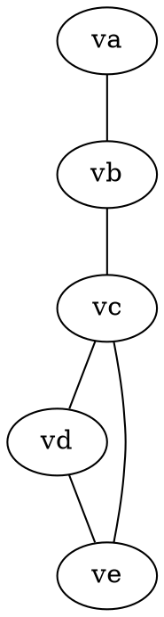
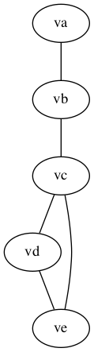
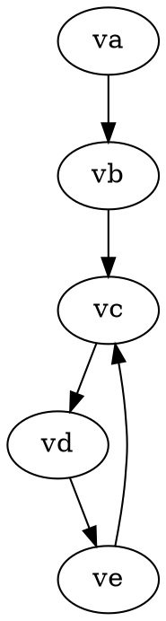
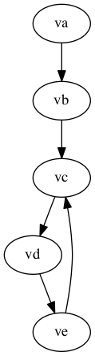

# example

A repo to store examples

# Graphviz

Graph Visualization Software [graphviz](http://www.graphviz.org/) is pretty
neat.  You can get crazy complicated, or stay simple.

## Basic graph

Something like [hello.dot](hello.dot) is a basic graph:

which can be transformed by running `dot -Tpng hello.dot > hello.png` which
yields [hello.png](hello.png).

## Basic digraph

Something like [hello_digraph.dot](hello_digraph.dot) is a basic digraph:

which can be transformed by running `dot -Tpng hello_digraph.dot > hello_digraph.png` which
yields [hello_digraph.png](hello_digraph.png).

