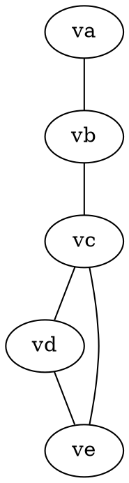
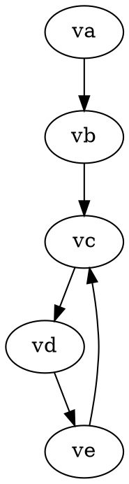
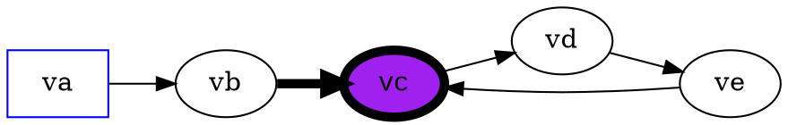
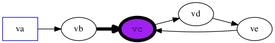

# example

A repo to store examples

# Graphviz

Graph Visualization Software [graphviz](http://www.graphviz.org/) is pretty
neat.  You can get crazy complicated, or stay simple.

## Basic graphs

### Undirected graphs

Something like [hello.dot](hello.dot) is a basic graph:



which can be transformed by running `dot -Tpng hello.dot > hello.png` which
yields [hello.png](hello.png).


### Directed graphs (digraph)

Something like [hello_digraph.dot](hello_digraph.dot) is a basic digraph:



which can be transformed by running `dot -Tpng hello_digraph.dot > hello_digraph.png` which
yields [hello_digraph.png](hello_digraph.png).


## Basic attributes

You can change things like the orientation of the graph, or the node shapes.





## Output types

You can change the output type (or device) with the `-T` parameter.

Use the `-v` option to get the list of supported output devices:

```shell
$dot -v
dot - graphviz version 2.38.0 (20140413.2041)
libdir = "/Users/bentaylo/macports/lib/graphviz"
Activated plugin library: libgvplugin_dot_layout.6.dylib
Using layout: dot:dot_layout
Activated plugin library: libgvplugin_core.6.dylib
Using render: dot:core
Using device: dot:dot:core
The plugin configuration file:
        /Users/bentaylo/macports/lib/graphviz/config6
                was successfully loaded.
    render      :  cairo dot fig gd lasi map pic pov ps quartz svg tk vml vrml xdot
    layout      :  circo dot fdp neato nop nop1 nop2 osage patchwork sfdp twopi
    textlayout  :  textlayout
    device      :  bmp canon cgimage cmap cmapx cmapx_np dot eps exr fig gd gd2 gif gv icns ico imap imap_np ismap jp2 jpe jpeg jpg pct pdf pic pict plain plain-ext png pov ps ps2 psd sgi svg svgz tga tif tiff tk vml vmlz vrml wbmp webp x11 xdot xdot1.2 xdot1.4 xlib
    loadimage   :  (lib) bmp eps gd gd2 gif jpe jpeg jpg pdf png ps svg webp xbm
```

For example, to produce a eps or pdf file for use within LaTeX, you could use:

`dot -Tpdf hello_digraph.dot > hello_digraph.pdf` which yields [hello_digraph.pdf](hello_digraph.pdf).
